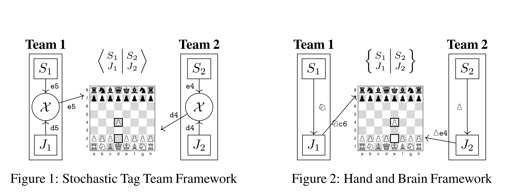

# Designing Skill-Compatible AI
## Methodologies and Frameworks in Chess

  

## Preliminaries

The code for testing agents on our framework is included in maia-partner. The maia-training-rl folder contains the code necessary to create the att agents. Before running any of the codes, you will need to have `lc0` compiled on your device, because our agents are technically neural network weights that require an actual engine to be run. Included in both folders are requirements.txt files; it is recommended to use them to set up conda environments that match ours. Our own testing was done using Ubuntu 18.04, and CUDA 9.1. To match our code, it is recommended to compile `lc0` with `cudnn` (requires a GPU);  (during compilation it will indicate whether `cudnn` has been detected or whether it's defaulting to CPU). We believe our code can equivalently be run on CPU, however, GPU-specific parameters will have to be removed from the agents' instantiations.

## Models

We have included, in the models folder, the exact weights of leela that we use (128x10), as well as maia1100, the main engine used in our testing, attt, and atth. Should you wish to work with other models of maia, you may find them at https://github.com/CSSLab/maia-chess.

## Getting started

Inside maia-partner, there are four ready-to-run files, `STT_test_tree+att.py`, `STT_test_exp.py` (these two files are for the tag team framework, testing the tree, attuned agents, and expector agents), and analogously for hand and brain, `HB_test_tree+att.py` and `HB_test_exp.py`. Simply running them from python will work, however, you may need to modify the path of `lc0` as used in instantiating the engines, as well as removing the GPU options if your `lc0` is not configured to use the GPU.

In the files, `name_of_run` specifies a directory that will be created in battle_results to store the results of the matches being played. `results.txt` will store the result, and the value in the simple results matrix is W-L, from leela's perspective, take note of the sign flip.`weight_files` specifies the weights of the partners being tested, with the first weight always being leela's weights against which other weights are tested in the framework. For the expector, only leela's weights are passed, and the additional weights necessary are passed in instantiation. Agent instantiation happens in the `worker` function. Running these files as is is sufficient to observe the main result of our work, that these agents outperform leela in the framework. Should you wish to run your own tests, you can modify the weight paths in `weight_files` and the instantiations in `worker`, as well as any modification to the `agent` class. (for example, having the partner play all the time to test raw strength).

## Going further

### Analysis

To conduct move analysis, we provide  two files, `STT_stats.py` and `HB_stats.py`, that contain code that computes losses across boards, and hypothetical "what if's" in the case of $STT$. These files will need connection to a mongoDB instance to save results, but you may save them elsewhere by modifying all references to `mycol`.The metrics are recorded in `anarray`, which are in the main dictionary which stores the game itself and other metrics.

### Training

To train att agents, the way we did, using maia-training-rl, follow these steps:

1) Run `generate_games.py`. Remember to set the partner names and weights as appropriate (use leela's weights for both partners as the supplement of the main paper indicates). Check your mongo instance to make sure the games are generated as expected, and take note of the name of the games. Wait until there are at least 8000 training, 1000 validation, and 1000 test set games.
2) Run the following command `python db_to_training_format.py col_name game_name g0 data_name --onlyme=1`, where `col_name` is the mongo column where the games are stored, `game_name` is the name of the games as viewed by inspecting them in the database, and data_name is the desired name for the folder holding your data. If this step is successful, you will see a new folder named data_name `in train/data`.
3) Afterwards, train the model with `python train.py /path/to/configuration/configfile.yml data_name/g0 new_model_name/g1/v0 --starting_model_path=/path/to/leela_checkpoint_file.` where `data_name` is that selected from the previous step, `new_model_name` is the desired name for the new model. Your weights will be in `train/final_model` upon completion, where they can be used for testing.

Some notes:
You will need to rename the paths in these folders to your corresponding directories. To create a checkpoint file from leela's weights for training, use https://github.com/leela-zero/leela-zero/blob/3ee6d20d0b36ae26120331c610926359cc5837de/training/tf/net_to_model.py, with leela's weights (provided) as input.

